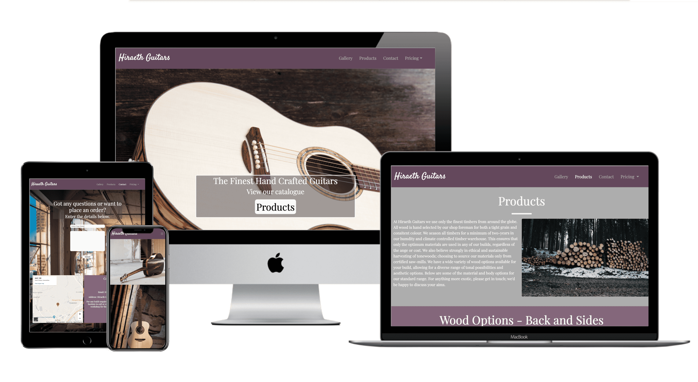
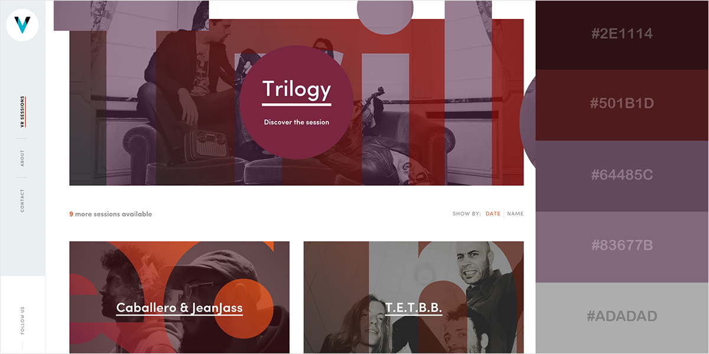
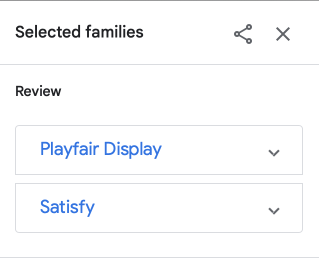

# Hiraeth Guitars

Hiraeth Guitars is an imagined luthier of fine hand-made acoustic guitars. Based in Wales; Hiraeth is an almost untranslatable Welsh word meaning "a mixture of longing, yearning, nostalgia, wistfulness or an earnest desire for the Wales of the past."
The Goals of the project are:
 * To showcase the products on offer
 * Inform the user of the options available when ordering a product
 * Allow the user an easy process to place and order
 * Develop a sense of trust about the brand

 

 The deployed site can be viewed [here](https://luketedwards.github.io/user-centric-frontend-development-milestone-project/index.html)
## User Experience (UX)
---

* ### User stories.
   * As a first time user I want to:

    1. Be able to immediately grasp to purpose of the website and the services on offer.

    2. Intuitively and quickly navigate the website to the relevant pages.

   3. Develop a sense of trust and connection to the brand through testimonials and social proof. This includes a well displayed social media footprint. 
     
* As a returning visitor I want to:

    1. Be able view visual updates of current and past guitar builds. 

    2. Be able contact the business to discuss my options when ordering a guitar.

    3. View an up-to-date price list for all models and options of guitars on offer.

* As a site owner I want to:

   1. Easily convey my services and available options in a clear manner, so as to avoid unnecessary questions from prospective customers.

## 1.Strategy
---
* Project Purpose
   * To showcase and promote a range of fine handmade guitars.
   * To clearly communicate the range of wood options and body styles on offer, and educate users on their tonal impact on the guitar build.
   * To create a space to display past and current work of the luthier, alongside information about the products.
   * To provide a simple way to contact and commision a build, and view an up-to-date resource of pricing across all options and body styles. 

## 2.Scope
---
* I wanted a simple and intuitive user experience.
* I wanted all content on the site to be clearly displayed in a concise manner.
* I wanted a downloadable resource to inform users of current prices when accounting for all available options.
* A responsive site that functions well across a range of devices and screensizes.
## 3.Structure
---
* The site features a clear and intuitive navigation bar and footer, that responds to different screen sizes. 
* The layout is clear and intuitive to ensure users can quickly traverse the site and find what they are looking for.
* The index.html page succinctly communicates the idea and purpose of the website, to immediately inform users of what the site is about.
* The Gallery cleanly displays images of past builds and products, whilst offering a clean hover card displaying further information about each image. This prevents needless visual clutter from written descriptions.
* The products page clearly displays all available options for both wood and body style. This is backed up by both a written description and audio representation of the effect each option has on the tone of the instrument.
* The contact page allows an intuitive and simple way to get in touch with the luthier through a contact form. There is also more traditional contact details below to either call the business, or generate an email through a hyperlink. A google map is also embedded to allow users to drop in on a tour of the workshop.
* The footer cleanly displays links to all the brands social media pages, to help develop a sense of social trust.

## 4.Skeleton
---
### Wireframes
Wire frames were generated using Balsamiq, and can be viewed below.

* [Home Page](assets/wireframes/home-page.png)
* [Gallery](assets/wireframes/gallery.png)
* [Products Page](assets/wireframes/products-page.png)
* [Contact Page](assets/wireframes/contact-page.png)


## 5.Surface
---

### Colour Scheme

The main colours used in development of the website are a darker and lighter shade of purple, a light grey, and an off white. I chose these as I felt they made the site inviting and imbued a sense of warmth.



### Typography

The two fonts used are "Playfair Display" for all the body content, and "Satisfy" for the logo. Both are backed-up by "Sans-Serif" should they fail to load from [Google fonts](https://fonts.google.com).



### Imagery

The imagery used throughout the site is intended to showcase the works of the luthier; with many examples of previous work, images of both the workshop, and wood harvesting process, and examples of possible wood and body style options for the instruments.

I have chosen to use a large and striking image of a beautifully made guitar as the index.html page's hero image. This is to quickly capture the attention of prospective customers. 

## Features
---
### Landing Page Image

A striking a beatiful image was used for the landing page. This is animated to catch the users attention.
Overlayed across the image is some hero text to instantly convey the nature of the site to users, and a products button to take the user to view the range of guitars on offer.


### Navigation bar

Consistent throughout the website is a sleek and intuitive navigation bar. The main features of the navbar are:

* Logo text that links to the home page.
* Active link colours to indicated the current page the user is on.
* Hover colours for the links. 
* A drop down menu for the pricing link that offers a PDF for the pricing as both a viewable link and a download link.
* The navbar collapses into a toggle drop-down button on smaller screensizes.


### Footer Displaying Social Links

Each page has a consistent footer which displays link icons for all of the brands social media pages. The copyright is also displayed here.


### Gallery Hover Cards

The gallery section is layed out in a masonry style. To keep this clean uncluttered view, information about each image is stored in a hover card, viewable when either hovering or clicking on the image.


### Products Page Audio

The products page is populated by both visual representations of the wood options, a written description of each wood and its merits, and an audio feature demonstrating the tonal impacts of each choice.


## Technologies Used
---
### Languages Used

* HTML5
* CSS3

### Framework & Libraries Used

* Bootstrap 4.4.1:
  * Bootstrap was utilised to quickly build a responsive framework for the website, before being overwritten to add my own style.

2. Google Fonts:
   * Google Fonts was used to import the "Satisfy" and "Playfair Display" fonts into my style sheet. I also used Google Fonts to download these fonts to my machine for creating the "Price List" PDF in Affinity Photo.

3. Font Awesome:
   * Font Awesome was used to provide icons to social media on all of the webpages in my project.

4. Git:
   * Git was used for version control to backup my project. I did this through terminal commands to commit to Git and push externally to GitHub.

5. GitHub:
   * GitHub was used to store all of my project code after being pushed from Git.

6. Affinity Photo/Publisher:
  * Affinity software was used to create my "Price List" PDF. 

7. Balsamiq:
  * Balsamiq was used to generate my wireframes to guide my design process.

8. Logic Pro X
  * Logic Pro X was used to capture and edit the audio for the products page. I improvised an acoustic track, and then Equalised it 9 different times to represent the effect of the wood/body choice on the products page.

# Testing User Stories from the User Experience (UX) Section

 * First Time Visitor Goals

 i. As a first time visitor to the website, I want to be able to immediately grasp to purpose of the website and the services on offer.

a. The landing page immediately presents the user with a large and appealing image of a hand-built guitar. Over-lain across this hero image is some descriptive text detailing the nature of the website, and a "Products" button, to easily take the user to view further more detailed information about the business. 

b. The purpose of the website is immediately apparent to the visitor, and presents them with an easy option to either view the product range, or scroll further down the page to learn more about the ethos of the business, and to read customer testimonials. 

ii. I want to be able to intuitively and quickly navigate the website to the relevant pages.

a. The website is designed with a sleek and intuitive navigation bar at the top of each page. This nav-bar makes it easy to traverse the website and is responsive to all screen sizes. On larger screens it extends horizontally across the top of the page and provides a drop-down menu with two options for the pricing PDF. On smaller screens it collapses into a sleek toggle button, which opens vertically down the right-hand side of the page when toggled.

b. The footer is consistent across all pages, offering links icons to all the relevant social media platforms. It also offers an easy sign up option for prospective customers to join the newsletter.

c. On the contact page there is an intuitive contact form for customers to submit their email address, and questions or build specifications for a products. At the bottom of the page is both an imbedded i-frame map showing the location of the workshop, along with a contact details tab, which provides the relevant email address and phone number of the business. The email address is also an anchor tag, which when clicked directs the customers device to automatically generate an email draft.

.iii I want to develop a sense of trust and connection to the brand through testimonials and social proof. This includes a well displayed social media footprint. 

a. On the landing page are clearly displayed customer testimonials, featuring both the names and photo's of happy clientele. 

b. At the footer of each page are well displayed and interactive icon links, directing to all of the relevant social media accounts for the brand. 

### Returning Visitor Goals

 i. As a returning visitor I want to be able view visual updates of current and past guitar builds. 

a. The website features a sleek and clean gallery section. This allows for an aesthetically pleasing place to show off the brands current and past builds to prospective customers and followers of the workshop.

b. Each page offers a simple way to sign up to a newsletter, within which photos and updates could easily be shared about the brand.

c. The footer contains clear links to all of the brands social media accounts, such as Facebook and Instagram. On these accounts visual updates from the brand could easily be shared and viewed.

ii. I want to easily be able contact the business to discuss ordering a guitar.

a. The contact page features an intuitive and detailed contact form through which customers can go in-depth with their questions or requirements.

b. The contact page also features a "Contact Details" section, including a linked email address that will automatically generate an email draft to the business. 

c. The website features two easy ways to view the current build options and price lists, both as an online viewable PDF and as a direct download link.

D. The products page shows in depth all of the possible build options for the guitars. This includes images of the wood, a written description of their tonal qualities, and an audio demonstration. 

### Frequent User Goals

i. As a frequent user of the website, I want to be able to easily sign-up to a newsletter, to stay up-to-date on current news.

a. The footer of each page on the website has a quick and easy news letter sign-up process located just below the social media links. 

## Further Testing
---
### Validator Results

* All Html pages passed through the official Jigsaw validator with no errors.

* The CSS stylesheet passed through the official W3C validator with no issues, aside from the Safari Media queries "Stroke-color" property not being recognised. I attempted to resolve this but changing it caused my Safari browser bug fix to no longer work.

### Device Testing

* The website was tested on multiple web-browsers including Safari, Chrome, Firefox and Brave.

* The website was viewed on multiple devices with varying screen sizes. These include iPhone 11's, iPad air, iPad pro, 16 inch Macbook pro and a 13 inch Acer laptop.

* All links and pages were tested thoroughly across various browsers and screen sizes.

* Family members trialled the website on their own devices to both give feedback and look for bugs. 

### Known Bugs

* On one of the iPads tested, when using the Safari browser the hero image on index.html only loads halfway. This did not happen when using the Chrome browser instead. 

* On the iPad air the hero image loads roughly 3/4 of the way when using Safari.

### Notable Solved Bugs

* When using the Safari browser on any device, the font awesome icons in the footer displayed further left than intended. On all other browsers they displayed where I meant them too.

   a. I solved this by using Safari only media queries to push the icons over by 70px. The solution was my own idea, however I googled the code for the Safari media queries, and found it on [Browserstack](https://www.browserstack.com/guide/create-browser-specific-css). 

* When testing the website using Chrome Developer tools, white space appeared to the right of the webpage when the screen size was reduced enough. 

a. I googled this issue and found a solution. [Stackoverflow](https://stackoverflow.com/questions/4617872/white-space-showing-up-on-right-side-of-page-when-background-image-should-extend/5805134]) suggested that the code snippet 

`html,body
{
    width: 100%;
    height: 100%;
    margin: 0px;
    padding: 0px;
    overflow-x: hidden; 
}`

would solve the issue. This worked to some extent, however the "overflow-x:hidden" caused content on the right-hand side of the website to not display on larger screens. To solve this I set the overflow to visible and wrote a media query that sets it back to hidden when the breakpoint is reached for the white space to appear.  

`@media screen and (max-width:700px) {
    html, body{
        overflow-x:hidden;
    }`

## Deployment
---

 ### GitHub Pages

 The project was deployed to GitHub Pages using the following steps...

 1. Log in to GitHub and locate the [GitHub Repository](https://github.com/)
 2. At the top of the Repository (not top of page), locate the "Settings" Button on the menu.
     - Alternatively Click [Here](https://raw.githubusercontent.com/) for a GIF demonstrating the process starting from Step 2.
 3. Scroll down the Settings page until you locate the "GitHub Pages" Section.
 4. Under "Source", click the dropdown called "None" and select "Master Branch".
 5. The page will automatically refresh.
 6. Scroll back down through the page to locate the now published site [link](https://github.com) in the "GitHub Pages" section.

 ### Forking the GitHub Repository

 By forking the GitHub Repository we make a copy of the original repository on our GitHub account to view and/or make changes without affecting the original repository by using the following steps...

 1. Log in to GitHub and locate the [GitHub Repository](https://github.com/)
 2. At the top of the Repository (not top of page) just above the "Settings" Button on the menu, locate the "Fork" Button.
 3. You should now have a copy of the original repository in your GitHub account.

 ### Making a Local Clone

 1. Log in to GitHub and locate the [GitHub Repository](https://github.com/)
 2. Under the repository name, click "Clone or download".
 3. To clone the repository using HTTPS, under "Clone with HTTPS", copy the link.
 4. Open Git Bash
 5. Change the current working directory to the location where you want the cloned directory to be made.
 6. Type `git clone`, and then paste the URL you copied in Step 3.

 ```
 $ git clone https://github.com/YOUR-USERNAME/YOUR-REPOSITORY
 ```

 7. Press Enter. Your local clone will be created.

 ```
 $ git clone https://github.com/YOUR-USERNAME/YOUR-REPOSITORY
 > Cloning into `CI-Clone`...
 > remote: Counting objects: 10, done.
 > remote: Compressing objects: 100% (8/8), done.
 > remove: Total 10 (delta 1), reused 10 (delta 1)
 > Unpacking objects: 100% (10/10), done.
 ```

 Click [Here](https://help.github.com/en/github/creating-cloning-and-archiving-repositories/cloning-a-repository#cloning-a-repository-to-github-desktop) to retrieve pictures for some of the buttons and more detailed explanations of the above process.

# Credits

## Code 

* Bootstrap4: Bootrap Library was used throughout the intial setup of the website to help with both responsivness and layout.

* Code from [Stackoverflow](https://stackoverflow.com/questions/4617872/white-space-showing-up-on-right-side-of-page-when-background-image-should-extend/5805134) and [Browserstack](https://www.browserstack.com/guide/create-browser-specific-css) was used to help solve the bugs listed in the bug section. I also used a snippet of code from a [Code Institute](https://www.codeinstitute.com) lesson to create the hero image animation, however I then modified this for my own website.

## Content

* All content was written by the developer.

* My colour scheme was chosen from this blogpost by [Visme](https://visme.co/blog/website-color-schemes/).

## Media

* All audio was created by the developer.

* Royalty free images were taken from [Unsplash](https://unsplash.com), [Freeimages](https://freeimages.com) and [Pixabay](https://pixabay.com), specifically from the following people:

> Man playing guitar hero image - Photo by Hannah Gibbs on Unsplash 

>Guitar rear image Photo by Maxime Favier on Unsplash 

>Guitar front image Photo by Maxime Favier on Unsplash 

>Guitar Hero Image Photo by Maxime Favier on Unsplash 

>Guitar rear dark Photo by Maxime Favier on Unsplash 

>Guitar rear dark on stand Photo by Maxime Favier on Unsplash 

>Guitar front dark Photo by Maxime Favier on Unsplash 

>Guitar side dark Photo by Maxime Favier on Unsplash 

>Light guitar front by Maxime Favier on Unsplash 

>Light guitar front 2 by Maxime Favier on Unsplash 

>Light guitar rear side by Maxime Favier on Unsplash 

>Timber stack Photo by Ales Krivec on Unsplash 

>Ebony wood Photo by Mockup Photos on Unsplash 

>Workshop Devin Berko on Unsplash 

>Man photo Cibelly Roberta on Unsplash 

>Woman 1 Brooke Cagle on Unsplash 

>Woman 2 Omar Lopez on Unsplash 

>Mahogany Image by jessicuak from Pixabay 

>Maple Photo by stephan fleet from FreeImages

>Spruce Photo by jean wimmerlin on Unsplash

>Adirondack spruce Photo by Pawel Czerwinski on Unsplash

>Cedar by FWstudio on Unsplash

>OM guitar Photo by Gayatri Malhotra on Unsplash

>Jumbo guitar Photo by Maxime Favier on Unsplash

>Dreadnaught Photo by Daniel Lima on Unsplash

## Acknowledgements
---

* My mentor Rahul Lakhanpal for his support and invaluable advice throughout my project.

* Code Institute for their excellent learning platform and student support.
